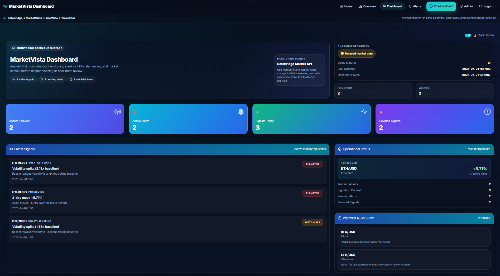
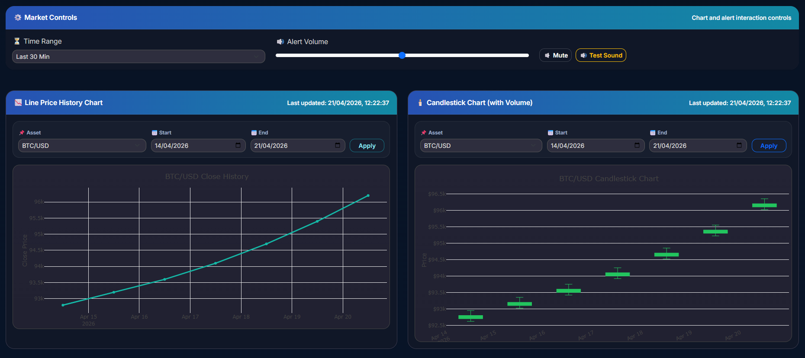
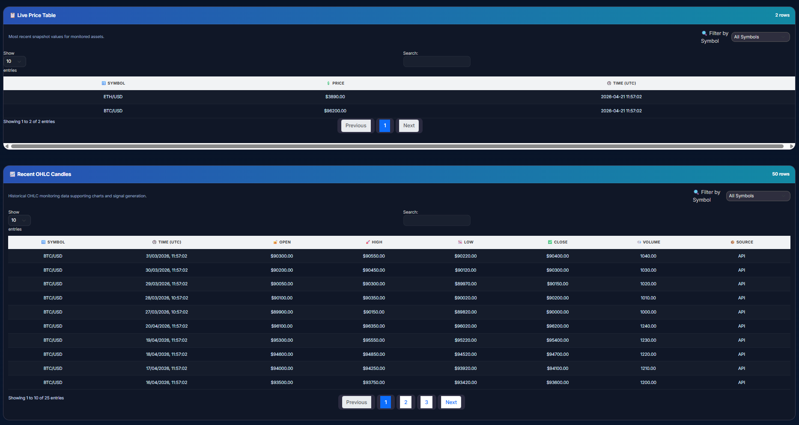
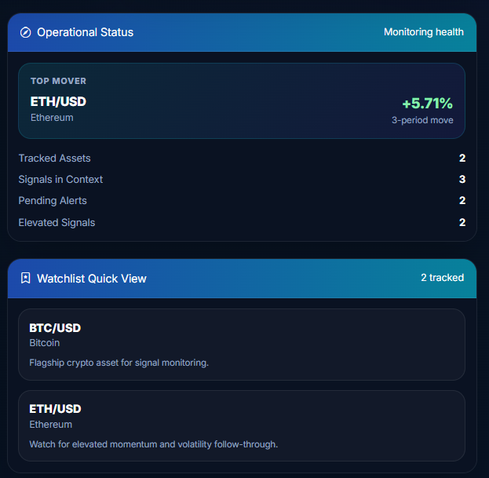
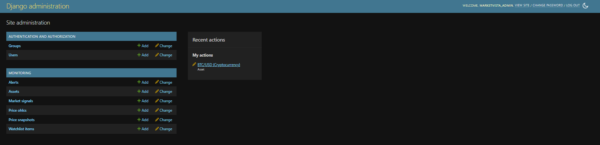
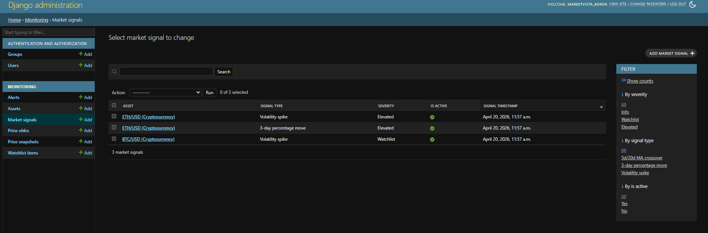
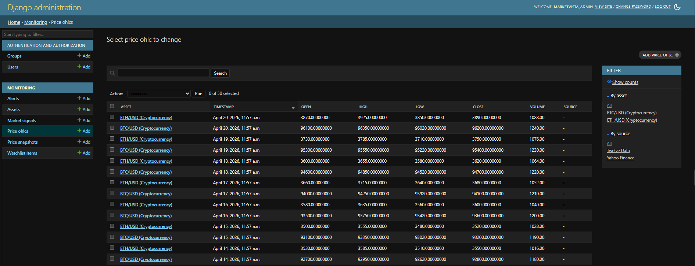
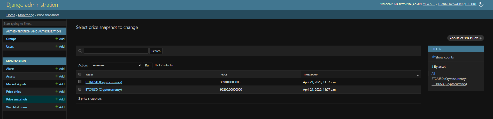

# MarketVista Dashboard

> **Monitoring-first analyst visibility layer in a four-project FinTech portfolio suite.**

[](#local-setup-and-demo-run)
[](#what-this-proves-to-hiring-managers)
[](#validation-commands)
[](#current-status)

---

## Suite position

```text
DataBridge Market API → MarketVista Dashboard → RiskWise Planner → TradeIntel 360
  upstream data / ETL      monitoring / visibility   pre-trade planning   post-trade review
```

MarketVista Dashboard is the **monitoring and analyst-visibility layer** in a four-project FinTech workflow. It sits at the point where upstream market data becomes freshness-aware signals, watchlist-driven attention, and analyst-readable chart and table surfaces.

**This project is the monitoring layer. It is not an ingestion platform, risk planner, trade journal, or post-trade review product.**

---

## One-line summary

MarketVista Dashboard is a monitoring-first analyst console that turns persisted market data into signals, freshness awareness, watchlist visibility, and chart/table inspection surfaces within a broader FinTech decision workflow.

---

## What this proves to hiring managers

This repository is designed to show not just a polished dashboard, but the underlying engineering decisions, data model structure, service-layer separation, seeded demo workflow, and reviewer-ready packaging behind it.

| Skill | How proven | Where to look |
|---|---|---|
| Django application architecture | Monitoring-specific models, admin layer, service package, split views, seed command, and smoke tests working together in one coherent product | `monitoring/models.py`, `monitoring/admin.py`, `monitoring/views/`, `monitoring/services/`, `monitoring/management/commands/seed_demo_data.py`, `monitoring/tests/test_smoke.py` |
| Domain-driven design | `MarketSignal` is kept separate from `Alert`, with signal type and severity treated as first-class domain concepts | `monitoring/models.py` |
| Service-oriented backend | Monitoring logic is split into `market.py`, `signals.py`, `watchlist.py`, and `alerts.py` rather than being scattered across views/templates | `monitoring/services/` |
| Signal algorithm implementation | Volatility spike, percentage move, and moving-average crossover logic feed persisted signals with severity mapping | `monitoring/services/signals.py` |
| Monitoring-first product thinking | Freshness, elevated conditions, top mover, and watchlist support are prioritized over trading workflows | `/dashboard/` |
| Data modelling | `Asset`, `PriceSnapshot`, `PriceOHLC`, `MarketSignal`, `WatchlistItem`, and `Alert` support the monitoring workflow | `monitoring/models.py` |
| Admin inspectability | Reviewers can inspect assets, signals, OHLC history, snapshots, alerts, and watchlist items in Django admin | `/admin/monitoring/` |
| Seed data management | `seed_demo_data` creates a reviewer-ready state with assets, OHLC rows, snapshots, signals, alerts, and watchlist entries | `monitoring/management/commands/seed_demo_data.py` |
| Chart integration | Line history and candlestick visuals are backed by persisted OHLC data and date-range controls | `/dashboard/`, `/assets/<symbol>/` |
| Premium UI execution | Dark monitoring console with shared shell styling, reusable components, page-level CSS, and page-specific JavaScript | `monitoring/templates/`, `monitoring/static/css/`, `monitoring/static/js/` |
| Validation baseline | Smoke tests cover critical routes, seed flow, and seeded API/data behavior | `monitoring/tests/test_smoke.py` |
| Reviewer-ready packaging | README, walkthrough docs, screenshot pack, interview notes, and proof checklist support fast review | `docs/` |

---

## Reviewer path (3 minutes)

If you only have a few minutes to review this project:

1. Run:
   ```bash
   python manage.py migrate
   python manage.py seed_demo_data
   python manage.py runserver
   ```
2. Open `/dashboard/`
3. Review:
   - freshness
   - KPI cards
   - latest signals
   - top mover
   - watchlist
   - charts
   - alert summary
4. Open `/admin/`
5. Inspect:
   - Assets
   - Alerts
   - Market signals
   - Price OHLCs
   - Price snapshots
   - Watchlist items

---

## Screenshot gallery

### Dashboard — hero, signals, and monitoring command surface



The flagship monitoring surface: suite positioning, snapshot freshness, KPI cards, latest signals, operational status, and watchlist quick view.

**Proof:** the product reads as a monitoring-first analyst console, not a generic dashboard.

---

### Dashboard — charts



Line history and candlestick views backed by stored OHLC data, with date-range controls and shared monitoring controls.

**Proof:** charting is tied to persisted market structure rather than decorative frontend-only visuals.

---

### Dashboard — tables



Live snapshot table and recent OHLC table with filters and pagination for analyst inspection.

**Proof:** the dashboard includes tabular monitoring surfaces alongside charts, not just visual summaries.

---

### Dashboard — operational status and watchlist



Freshness, top mover, elevated signal count, and tracked watchlist items shown together in one operational review surface.

**Proof:** the dashboard is designed to answer what matters now and which asset deserves deeper review.

---

### Admin — monitoring model index



Monitoring admin index showing Assets, Alerts, Market signals, Price OHLCs, Price snapshots, and Watchlist items.

**Proof:** the project includes a real inspectable admin/data layer, not just a polished frontend.

---

### Admin — market signals



Persisted signals are visible in the admin with filter support by severity, signal type, and active status.

**Proof:** signal computation is persisted, inspectable, and separated cleanly from dashboard presentation.

---

### Admin — price OHLC data



Stored OHLC history across tracked assets, including open, high, low, close, volume, and source fields.

**Proof:** chart rendering and signal computation are backed by persisted historical market data, not mocked frontend values.

---

### Admin — price snapshots



Most recent snapshot records per tracked asset, including price and timestamp.

**Proof:** freshness status and the latest price surfaces are backed by persisted snapshot rows.

---

## Signal logic

Signal generation lives in `monitoring/services/signals.py`.

### Volatility spike
Computes a recent realized-volatility ratio against the trailing baseline.

- moderate spike → `WATCHLIST`
- stronger spike → `ELEVATED`

### Percentage move
Computes short-window close-price change across recent OHLC periods.

- moderate move → `WATCHLIST`
- stronger move → `ELEVATED`

### Moving-average crossover
Computes short-term and long-term moving-average crossover conditions from recent close prices.

- initial crossover → `WATCHLIST`
- stronger confirmation can escalate to `ELEVATED`

Signals are stored as `MarketSignal` rows and surfaced both in the dashboard and the monitoring admin views.

---

## Core monitoring surfaces

| Surface | What question it answers |
|---|---|
| Snapshot Freshness | Is the monitoring data current enough to trust right now? |
| Assets Tracked | How many assets are actively in scope? |
| Active Alerts | How many user-defined alert conditions still matter? |
| Signals Today | How many system-computed monitoring events are active? |
| Elevated Signals | How many conditions are serious enough to escalate? |
| Latest Signals | What changed most recently and why? |
| Top Mover | Which asset moved the most and deserves attention? |
| Watchlist Quick View | Which assets are intentionally being watched? |
| Asset Browser | Which monitored assets are available for deeper inspection? |
| Asset Detail | What is happening on one asset when signals, alerts, and chart context are combined? |
| Alerts | Which threshold conditions are pending or triggered? |
| Create Alert | How do I convert a monitoring concern into a user-defined trigger? |
| Line Price History Chart | What has recent price direction looked like? |
| Candlestick / OHLC Chart | What does recent OHLC structure look like? |

---

## Architecture

```text
Browser
  └── Templates (monitoring/templates/monitoring/)
        └── Views package (monitoring/views/)
              ├── dashboard.py
              ├── asset.py
              ├── watchlist.py
              ├── signals.py
              ├── alerts.py
              └── auth.py
                    └── Services package (monitoring/services/)
                          ├── market.py
                          ├── signals.py
                          ├── watchlist.py
                          └── alerts.py
                                └── Models (monitoring/models.py)
                                      └── Database (SQLite / PostgreSQL)
```

> **Iron rule:** views stay thin, service functions hold monitoring logic, and templates remain presentation-focused.

---

## Project structure

```text
marketvista-dashboard/
├── marketvista/
│   ├── settings.py
│   ├── urls.py
│   └── wsgi.py
├── monitoring/
│   ├── management/
│   │   └── commands/
│   │       └── seed_demo_data.py
│   ├── migrations/
│   ├── services/
│   │   ├── __init__.py
│   │   ├── market.py
│   │   ├── signals.py
│   │   ├── watchlist.py
│   │   └── alerts.py
│   ├── static/
│   │   ├── css/
│   │   │   ├── tokens.css
│   │   │   ├── style.css
│   │   │   ├── app-shell.css
│   │   │   ├── components.css
│   │   │   └── pages/
│   │   │       ├── alerts.css
│   │   │       ├── asset-detail.css
│   │   │       ├── assets.css
│   │   │       ├── auth.css
│   │   │       ├── create-alert.css
│   │   │       ├── dashboard.css
│   │   │       ├── home.css
│   │   │       ├── signals.css
│   │   │       └── watchlist.css
│   │   ├── js/
│   │   │   ├── alerts.js
│   │   │   ├── app-shell.js
│   │   │   ├── asset-detail.js
│   │   │   ├── dashboard.js
│   │   │   ├── forms.js
│   │   │   ├── signals.js
│   │   │   └── watchlist.js
│   │   └── sounds/
│   ├── templates/
│   │   └── monitoring/
│   │       ├── alert_list.html
│   │       ├── asset_detail.html
│   │       ├── asset_list.html
│   │       ├── base.html
│   │       ├── create_alert.html
│   │       ├── dashboard.html
│   │       ├── home.html
│   │       ├── login.html
│   │       ├── register.html
│   │       ├── signals.html
│   │       └── watchlist.html
│   ├── tests/
│   │   ├── __init__.py
│   │   ├── test_models.py
│   │   ├── test_services.py
│   │   ├── test_smoke.py
│   │   └── test_views.py
│   ├── views/
│   │   ├── __init__.py
│   │   ├── alerts.py
│   │   ├── asset.py
│   │   ├── auth.py
│   │   ├── dashboard.py
│   │   ├── signals.py
│   │   └── watchlist.py
│   ├── admin.py
│   ├── apps.py
│   ├── models.py
│   └── urls.py
├── docs/
├── .env.example
├── manage.py
├── requirements.txt
└── README.md
```

---

## Local setup and demo run

```bash
# 1. Clone the repository
git clone https://github.com/aminulislam/marketvista-dashboard.git
cd marketvista-dashboard

# 2. Create and activate a virtual environment
python -m venv .venv
# Windows:
.venv\Scripts\activate
# macOS / Linux:
# source .venv/bin/activate

# 3. Install dependencies
pip install -r requirements.txt

# 4. Configure environment variables
cp .env.example .env
# Windows alternative: copy .env.example .env

# 5. Apply migrations
python manage.py migrate

# 6. Seed reviewer-ready demo data
python manage.py seed_demo_data

# 7. Create a superuser for admin access
python manage.py createsuperuser

# 8. Run the development server
python manage.py runserver
```

---

## Validation commands

```bash
# Django system check
python manage.py check

# Run smoke tests
python manage.py test

# Collect static files
python manage.py collectstatic --noinput
```

---

## What the seeded demo state includes

Running `python manage.py seed_demo_data` creates a repeatable reviewer-ready state:

| Data | Detail |
|---|---|
| Assets | 5 tracked assets |
| OHLC rows | 225 rows total |
| Price snapshots | 5 records |
| Market signals | Active seeded signals across multiple severities |
| Alerts | 3 demo alerts |
| Watchlist entries | 3 entries |
| Demo user | `marketvista_admin` |
| Dashboard state | Freshness, signals, watchlist, alerts, and asset review surfaces populated |

---

## Suite context

| Project | Role | Relationship to MarketVista |
|---|---|---|
| DataBridge Market API | Upstream ETL and market data ingestion | Powers MarketVista price snapshots and OHLC history |
| **MarketVista Dashboard** | **Monitoring and analyst visibility** | **This project** |
| RiskWise Planner | Pre-trade planning and risk modelling | Receives elevated-condition handoff for deeper planning |
| TradeIntel 360 | Post-trade analytics and outcome review | Reviews results after execution and later performance analysis |

When MarketVista surfaces an `ELEVATED` signal, the analyst routes into **RiskWise Planner** to model scenarios, evaluate pre-trade risk, and plan the position before entry. After execution, outcomes are reviewed in **TradeIntel 360** for post-trade analysis and performance review.

---

## Interview talking points

**Why is `MarketSignal` a separate model from `Alert`?**  
Alerts are user-defined threshold conditions — for example, “notify me when BTC crosses a target level.” Signals are system-computed analytical events — for example, volatility spikes or moving-average crossovers. They have different triggering logic, different lifecycles, and different consumers. Keeping them separate makes both easier to test and reason about.

**Why are signals computed in the services layer rather than in views or templates?**  
Signal computation requires database access, rolling calculations, threshold logic, and severity mapping. If that logic lived in a view, it would be tightly coupled to HTTP request handling and harder to test outside the request cycle. By keeping it in `services/signals.py`, the same logic can be reused by the dashboard, a management command, a scheduled task, or an API endpoint.

**What technical decision on this project are you most proud of and why?**  
Separating `services/signals.py`, `services/market.py`, `services/watchlist.py`, and `services/alerts.py` from the beginning was one of the strongest decisions in this project. Signal logic, market summary computation, watchlist operations, and alert aggregation are distinct concerns, and keeping them isolated made the code easier to extend and test.

---

## Best-fit role relevance

This project is most relevant to applications for:

- Analytics Engineer
- Data Engineer
- FinTech Backend Engineer
- Python / Django Developer
- BI and Reporting Platform Engineer
- Monitoring and Observability Platform Developer

---

## Current status

| Area | Status |
|---|---|
| Monitoring identity and suite positioning | Complete |
| Core models and services architecture | Complete |
| Dashboard, charts, signals, watchlist, alerts, and asset workflow | Complete |
| Split views / split template architecture | Complete |
| Shared shell + page CSS/JS structure | Complete |
| Seed demo and reviewer readiness | Complete |
| Admin inspectability | Complete |
| Smoke-test baseline | Complete |
| README, screenshots, and docs pack | In progress |
| Deployment polish | In progress |
| Expanded automated test coverage | In progress |
| CI workflow expansion | In progress |

---

## Documentation

| Document | Purpose |
|---|---|
| `docs/README_INDEX.md` | Entry point to the documentation pack |
| `docs/REVIEWER_WALKTHROUGH.md` | Reviewer path and expected outcomes |
| `docs/INTERVIEW_TALKING_POINTS.md` | Interview-ready explanations and technical framing |
| `docs/PROOF_PACKAGING_CHECKLIST.md` | Final screenshot and proof packaging checklist |
| `docs/SCREENSHOT_SHORTLIST.md` | Screenshot naming, order, and capture rationale |

---

## License

MIT — see [LICENSE](LICENSE) for details.

---

*MarketVista Dashboard is part of a four-project FinTech portfolio suite demonstrating a data-to-decision workflow: ingestion, monitoring, pre-trade planning, and post-trade outcome review.*
