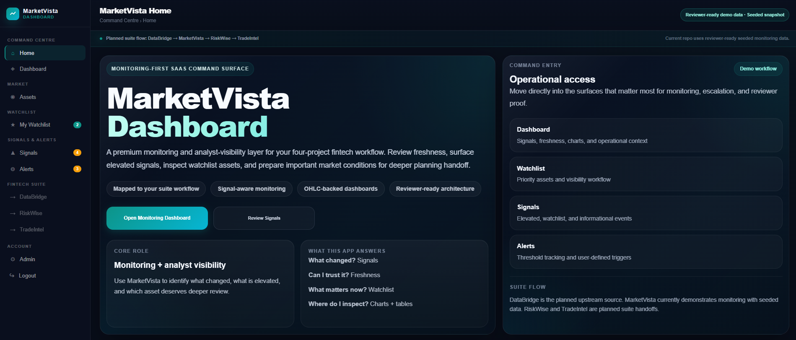
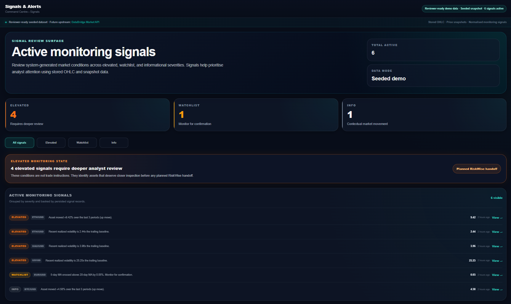
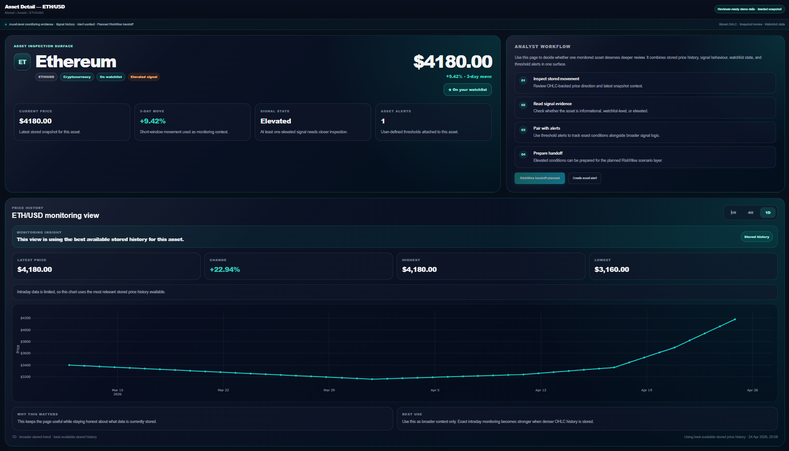
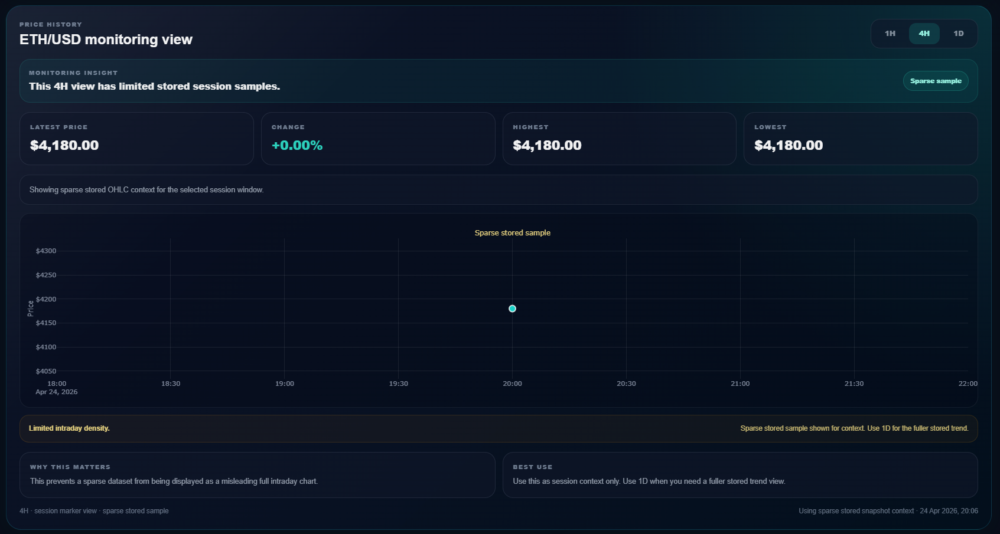
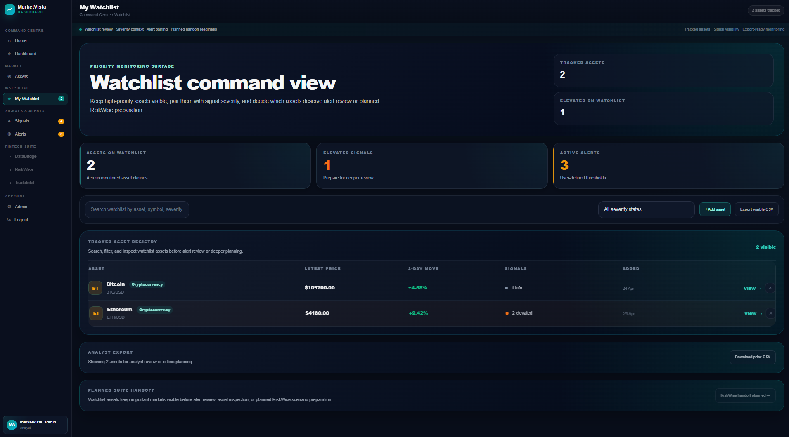
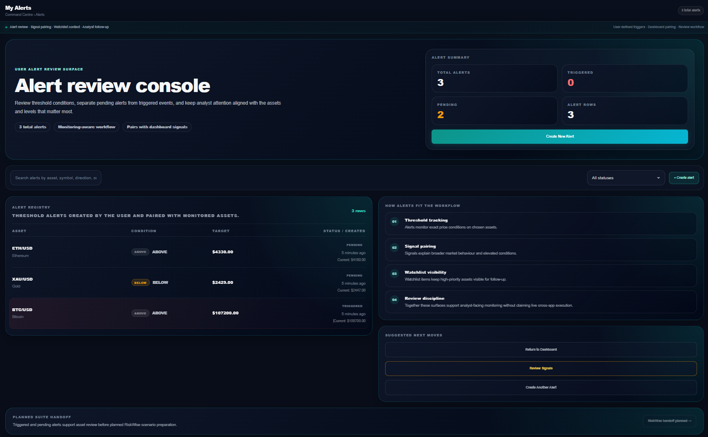
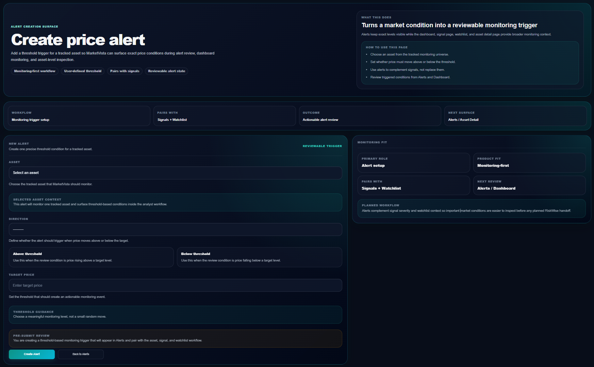
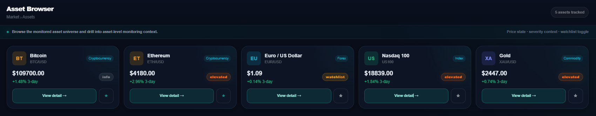
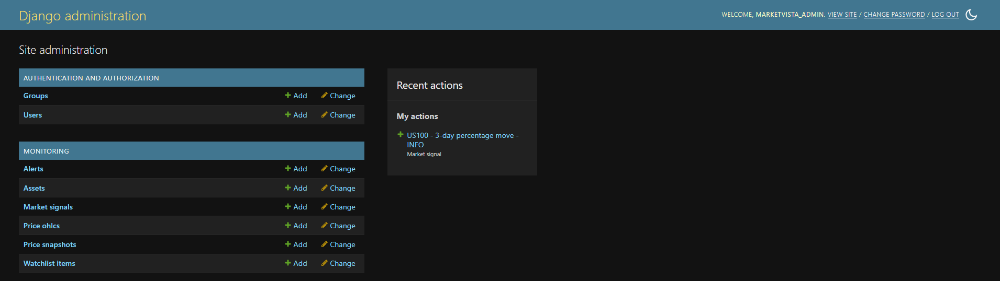

# MarketVista Dashboard

> **Monitoring-first analyst console for a four-project FinTech data-to-decision portfolio.**  
> MarketVista is the signal review, watchlist, alert, and asset-inspection layer between upstream market data and deeper risk/outcome analysis.

[](https://github.com/aminul-portfolio/marketvista-dashboard/actions/workflows/django-ci.yml)


---

## Hiring Manager Summary

**MarketVista Dashboard** is a Django-based monitoring and analyst-visibility product that turns stored OHLC market data and price snapshots into:

- severity-ranked market signals with inline methodology
- freshness-aware monitoring context
- watchlist prioritisation
- user-defined threshold alerts
- asset-level inspection with Plotly-backed charting
- honest sparse-data handling
- planned handoff context for deeper risk planning

The project is designed as a portfolio-grade FinTech data product, not a generic CRUD dashboard. It demonstrates Python/Django engineering, service-layer architecture, market-data modelling, implemented signal algorithms, Plotly charting, reviewer-ready seeded data, and premium SaaS-style UI execution.

**This repository is not** a trading bot, broker integration, live ingestion service, risk calculator, trade journal, or post-trade analytics platform.

---

## Portfolio Suite Position

MarketVista is one of four connected FinTech portfolio projects. Each project proves a different part of a broader data-to-decision workflow:

```text
DataBridge Market API  →  MarketVista Dashboard  →  RiskWise Planner  →  TradeIntel 360
  ingestion / ETL          monitoring / signals      pre-trade planning   outcome analytics
```

| Project | Portfolio Role | Current Relationship to MarketVista |
|---|---|---|
| **DataBridge Market API** | Upstream market-data ingestion and ETL layer | Planned future upstream source for snapshots and OHLC history |
| **MarketVista Dashboard** | **Monitoring, signals, watchlist, alerts, and asset visibility** | **This repository** |
| **RiskWise Planner** | Pre-trade scenario planning and risk preparation | Planned downstream handoff from elevated monitoring context |
| **TradeIntel 360** | Post-trade performance and outcome analytics | Planned downstream review layer after execution |

> DataBridge, RiskWise, and TradeIntel are represented as planned suite handoffs. This repository does **not** claim live cross-app integration.

---

## What MarketVista Answers

| Analyst Question | MarketVista Surface |
|---|---|
| What changed? | Signals page — `ELEVATED`, `WATCHLIST`, and `INFO` events with methodology context |
| Can I trust the data mode? | Freshness / seeded-demo status visible across the product |
| Which asset needs attention? | Dashboard top movers, Watchlist command view, and Signals page |
| What exact condition is being tracked? | Alert review console and Create Alert workflow |
| Where should I inspect next? | Asset Detail page with chart, signal history, active alerts, and planned RiskWise handoff |
| Is this live infrastructure? | No — the repository uses reviewer-ready seeded demo data and clearly labelled planned handoffs |

---

## Screenshot Gallery

<table>
<tr>
<td width="50%">

**1 — Home: Command Entry Surface**



Product role, seeded demo state, command-entry workflow, and planned suite positioning. Entry surface routes directly into monitoring context.

</td>
<td width="50%">

**2 — Dashboard: Monitoring Command Surface**


Tracked assets, active signals, elevated conditions, alert state, top mover, watchlist quick view, triggered alert, and planned suite handoff.

</td>
</tr>
<tr>
<td width="50%">

**3 — Signals: Severity-Ranked Review**



Severity-ranked ELEVATED, WATCHLIST, and INFO events with inline methodology, metric values, filter tabs, and planned RiskWise handoff.

</td>
<td width="50%">

**4 — Asset Detail: ETH/USD Inspection**



Asset-level inspection combining price state, short-window movement, signal severity, watchlist status, alert context, 4-step analyst workflow sidebar, and stored OHLC charting.

</td>
</tr>
<tr>
<td width="50%">

**5 — Sparse Intraday: Honest Data Handling**



4H view with a single stored data point. Labeled "Sparse sample" with "Why this matters" and "Best use" copy instead of rendering a misleading intraday chart.

</td>
<td width="50%">

**6 — Watchlist: Priority Monitoring**



Priority monitoring surface. 2 tracked assets · signal severity per row · 3-day move · BTC: 1 INFO · ETH: 2 ELEVATED · export CSV · planned RiskWise handoff.

</td>
</tr>
<tr>
<td width="50%">

**7 — Alerts: Review Console**



Alert review workflow showing pending and triggered user-defined threshold conditions, registry rows, workflow explanation, and suggested next moves.

</td>
<td width="50%">

**8 — Create Alert: Threshold Setup**



Alert creation surface for converting a tracked asset condition into a reviewable user-defined threshold trigger. Form styling uses dedicated CSS classes rather than JavaScript-injected inline styles.

</td>
</tr>
<tr>
<td width="50%">

**9 — Asset Browser**



5 instruments across crypto, FX, index, and commodity. Signal severity badges per card · watchlist star toggle · 3-day move visible without opening asset detail.

</td>
<td width="50%">

**10 — Django Admin: Monitoring Models**



6 inspectable monitoring models: Assets · Alerts · Market Signals · Price OHLCs · Price Snapshots · Watchlist Items. Dark mode admin with recent activity visible.

</td>
</tr>
</table>

---

## What This Project Proves

| Skill Area | Specific Evidence |
|---|---|
| Django application architecture | Split views package (6 files) + split services package (4 files) — no god-view, no god-service |
| Service-layer design | Views delegate business logic to service functions and pass the prepared context to the template, keeping request handlers focused on routing and rendering. |
| Domain modelling | Six models with appropriate constraints: `UniqueConstraint(user, asset)` on `WatchlistItem`, `TextChoices` on `MarketSignal`, indexed foreign keys throughout |
| Signal algorithms | Three algorithms with concrete thresholds computed from stored OHLC data, persisted as `MarketSignal` rows — no signal logic in views or templates |
| Alert/signal separation | System-computed signals and user-defined threshold alerts have different origins, lifecycles, and evaluation logic |
| URL routing for complex symbols | `<path:symbol>` converter handles `BTC/USD` — `<str:symbol>` rejects slashes and can break asset-detail URL generation for symbols such as `BTC/USD` |
| Global sidebar context | `alert_count`, `sidebar_elevated_count`, `watchlist_count` injected once via context processor — not duplicated per view |
| Severity colour discipline | ELEVATED=orange, WATCHLIST=amber, INFO=grey — red reserved exclusively for triggered alerts, applied consistently across templates |
| Honest sparse-data handling | 1H/4H views render a labeled single-point marker with explanatory copy rather than a misleading chart |
| Premium SaaS UI execution | Dark sidebar shell, page-specific CSS, DM Sans, Plotly charts, severity chips, staggered entrance animations |
| Admin inspectability | All 6 monitoring models registered with list display, filters, and search for reviewer verification |
| Validation baseline | 4 test modules · GitHub Actions CI on push to `main` |
| Portfolio packaging | Seeded demo · screenshot gallery · reviewer walkthrough · interview prep · explicit limitations |

---

## Signal Logic

Signals are system-computed from stored `PriceOHLC` data. The signal logic lives in `monitoring/services/signals.py`. Results persist as `MarketSignal` rows and are displayed across the dashboard, signals page, asset detail, and admin. No signal logic runs in views or templates.

### Algorithms and Thresholds

| Algorithm | WATCHLIST | ELEVATED | Seeded demo output |
|---|---|---|---|
| 3-period percentage move | ≥ ±3% | ≥ ±5% | ETH/USD +9.42% → ELEVATED · BTC/USD +4.58% → INFO |
| Volatility spike (realised vol vs 30-day baseline) | ≥ 1.5× | ≥ 2.0× | US100 25.25× → ELEVATED · XAU/USD 3.96× → ELEVATED · ETH/USD 2.44× → ELEVATED |
| MA crossover (5-day SMA vs 20-day SMA) | At crossover | On confirmation | EUR/USD 0.05% crossover → WATCHLIST |

### Severity Colour Rules

| Severity | Colour | Hex | Rule |
|---|---|---|---|
| `ELEVATED` | Orange | `#f97316` | Requires deeper review — never shown as red |
| `WATCHLIST` | Amber | `#f59e0b` | Monitor for confirmation |
| `INFO` | Grey | muted | Contextual market movement only |
| Triggered alert | Red | `#ef4444` | Reserved exclusively for triggered alert state |

This colour separation keeps analytical signals visually distinct from triggered user alerts and is applied consistently across templates.

### Signal Lifecycle

When a new signal of the same type is generated for the same asset, the prior signal's `is_active` is set to `False`. Each asset holds at most one active signal per algorithm type.

---

## Alert Logic

Alerts are user-defined threshold conditions. They are independent from system-computed market signals and are evaluated against the latest stored price snapshot.

```text
BTC/USD above $107,200  →  TRIGGERED  (current: $109,700)
ETH/USD above $4,330    →  PENDING    (current: $4,180)
XAU/USD below $2,429    →  PENDING    (current: $2,447)
BTC/USD above $12,000   →  PENDING    (current: $109,700)
```

An asset can simultaneously carry an `ELEVATED` signal, a watchlist state, and one or more pending or triggered alerts. The asset detail page surfaces all three together so the analyst can inspect the full monitoring picture without switching context.

---

## Architecture

```text
Browser
  └── Templates  (presentation layer — no domain logic)
        └── Views package  (request handling — delegates logic to services, renders result)
              ├── dashboard.py
              ├── asset.py
              ├── signals.py
              ├── watchlist.py
              ├── alerts.py
              └── auth.py
                    └── Services package  (core domain and workflow logic concentrated here)
                          ├── market.py    freshness · top movers · dashboard context
                          ├── signals.py   algorithm execution · severity mapping · deactivation
                          ├── watchlist.py per-user watchlist state · badge counts
                          └── alerts.py   alert aggregation · trigger evaluation
                                └── Models
                                      ├── Asset
                                      ├── PriceSnapshot
                                      ├── PriceOHLC
                                      ├── MarketSignal
                                      ├── WatchlistItem
                                      └── Alert
```

### Design Rules

- Views stay thin by delegating domain-heavy work to service functions, then passing prepared context to templates.
- Services do not import from views. Dependency is strictly one-directional.
- Templates present, never compute. No ORM lookups or aggregations in template logic.
- CSS is split between shell, reusable components, and page-specific files.
- JavaScript is page-specific where interaction is required.

---

## Tech Stack

| Layer | Technology | Version |
|---|---|---|
| Language | Python | 3.11 |
| Framework | Django | 5.2 |
| Charts | Plotly | 2.35 |
| Data processing | pandas · NumPy | — |
| Frontend | DM Sans · Bootstrap · Bootstrap Icons | 5.3 · 1.11 |
| CI | GitHub Actions | — |
| Static files | Whitenoise | — |
| Server | Gunicorn | — |

---

## Project Structure

```text
marketvista-dashboard/
├── .github/
│   └── workflows/
│       └── django-ci.yml
├── marketvista/
│   ├── settings.py
│   ├── urls.py
│   └── wsgi.py
├── monitoring/
│   ├── management/commands/
│   │   └── seed_demo_data.py
│   ├── services/
│   │   ├── __init__.py
│   │   ├── market.py
│   │   ├── signals.py
│   │   ├── watchlist.py
│   │   └── alerts.py
│   ├── static/css/
│   │   ├── tokens.css
│   │   ├── style.css
│   │   ├── app-shell.css
│   │   ├── components.css
│   │   └── pages/
│   ├── static/js/
│   ├── templates/monitoring/
│   │   ├── base.html
│   │   ├── dashboard.html
│   │   ├── signals.html
│   │   ├── asset_list.html
│   │   ├── asset_detail.html
│   │   ├── watchlist.html
│   │   ├── alert_list.html
│   │   ├── create_alert.html
│   │   ├── home.html
│   │   ├── login.html
│   │   └── register.html
│   ├── tests/
│   │   ├── test_models.py
│   │   ├── test_services.py
│   │   ├── test_smoke.py
│   │   └── test_views.py
│   ├── views/
│   │   ├── __init__.py
│   │   ├── dashboard.py
│   │   ├── asset.py
│   │   ├── signals.py
│   │   ├── watchlist.py
│   │   ├── alerts.py
│   │   └── auth.py
│   ├── admin.py
│   ├── context_processors.py
│   ├── forms.py
│   ├── models.py
│   └── urls.py
├── docs/
│   ├── screenshots/
│   ├── README_INDEX.md
│   ├── REVIEWER_WALKTHROUGH.md
│   ├── SCREENSHOT_SHORTLIST.md
│   ├── INTERVIEW_TALKING_POINTS.md
│   └── PROOF_PACKAGING_CHECKLIST.md
├── .env.example
├── .gitignore
├── manage.py
├── requirements.txt
└── README.md
```

---

## Local Setup

```bash
# 1. Clone
git clone https://github.com/aminul-portfolio/marketvista-dashboard.git
cd marketvista-dashboard

# 2. Create virtual environment
python -m venv .venv

# Windows
.venv\Scripts\activate

# macOS / Linux
# source .venv/bin/activate

# 3. Install dependencies
pip install -r requirements.txt

# 4. Configure environment
copy .env.example .env
# macOS / Linux:
# cp .env.example .env

# 5. Apply migrations
python manage.py migrate

# 6. Seed reviewer-ready demo data
python manage.py seed_demo_data

# 7. Create admin superuser if needed
python manage.py createsuperuser

# 8. Start the development server
python manage.py runserver
```

Open `http://127.0.0.1:8000/`

---

## Seeded Demo Data

`python manage.py seed_demo_data` creates a reproducible reviewer dataset. Uses `update_or_create` throughout — safe to run multiple times without duplicating rows.

| Item | Detail |
|---|---|
| Assets | 5 instruments — BTC/USD, ETH/USD, EUR/USD, US100, XAU/USD |
| Price snapshots | Latest stored price per asset |
| OHLC history | ~25 daily rows per asset · 30+ day date range |
| Market signals | 6 active — 4 ELEVATED, 1 WATCHLIST, 1 INFO |
| Alerts | 4 alerts — 1 triggered (BTC/USD above $107,200), 3 pending |
| Watchlist items | 2 entries with analyst context notes |
| Freshness state | `Reviewer-ready demo data · Seeded snapshot` on every page |

---

## Reviewer Path

Recommended 10-minute route:

```text
Home → Dashboard → Signals → Asset Detail (ETH/USD) → 4H sparse view → Watchlist → Alerts → Create Alert → Asset Browser → Django Admin
```

Direct URLs:

```text
/
/dashboard/
/signals/
/assets/ETH%2FUSD/
/watchlist/
/alerts/
/alerts/create/
/assets/
/admin/
```

> Asset detail URLs use `%2F` for symbols that contain a forward slash. Navigation from the asset browser handles this encoding automatically.

---

## Running Tests

```bash
python manage.py test
```

| Module | What it validates |
|---|---|
| `test_models.py` | Field constraints, `UniqueConstraint` on WatchlistItem, `TextChoices` values |
| `test_services.py` | Signal algorithm output with synthetic OHLC · severity mapping · deactivation logic |
| `test_smoke.py` | All pages return HTTP 200 with seeded data loaded |
| `test_views.py` | Auth redirects · watchlist add/remove · alert creation · asset detail 404 on unknown symbol |

CI runs automatically on push and pull request to `main` via `.github/workflows/django-ci.yml`.

---

## Interview Talking Points

### Why separate `MarketSignal` from `Alert`?

They have different origins and lifecycles. `MarketSignal` is system-computed from OHLC patterns — it appears automatically when an algorithm crosses a threshold and gets deactivated when a newer signal of the same type is generated for the same asset. `Alert` is user-defined — it persists until the user removes it and evaluates against `PriceSnapshot.price` rather than historical OHLC patterns.

If they shared a model, you could not test signal generation independently from user account state. You could not display "2 ELEVATED signals, 1 pending alert" on the same asset detail page without a confusing union query. Separation keeps each concern independently testable, inspectable, and visually distinct in the UI.

### Why support symbols such as `BTC/USD` and `ETH/USD` carefully?

`BTC/USD` contains a forward slash. Django's `<str:symbol>` URL converter uses the regex `[^/]+` — it rejects slashes and can break asset-detail URL generation for symbols such as `BTC/USD`. `<path:symbol>` uses `.+` which allows slashes. The fix is three characters — finding the cause requires knowing how Django compiles URL patterns.

### What is the strongest engineering decision?

The sparse intraday chart handling. When 1H or 4H timeframes are selected but the seeded dataset only contains daily OHLC rows, the chart renders a single labeled dot with "Sparse sample" and explanatory copy: "This prevents a sparse dataset from being displayed as a misleading full intraday chart." The alternative — an empty chart or a crash — would obscure the data quality problem. A reviewer who opens the 4H view immediately understands both the data model and the engineer's judgment about trust.

### Why use a service layer?

Three concrete consequences if you don't. First, views become untestable without HTTP context — service functions can be tested directly with no request object. Second, multiple surfaces that need the same calculation (dashboard signal count, signals page group, asset detail badge) each implement their own version and eventually drift. Third, when signal thresholds change, you update one function in `signals.py` rather than tracking changes across six templates and four views. The service layer is a maintenance decision with measurable consequences.

### Why use reviewer-ready seeded demo data?

A portfolio project should be reproducible without third-party credentials. Seeded data makes the product inspectable at a stable, known state — reviewers can verify the data model, run the tests, and navigate the full workflow without depending on live market-data access or API keys. The specific seeded values (ETH/USD +9.42%, US100 25.25× volatility) are chosen to exercise every severity tier and signal algorithm.

---

## Current Limitations

| Limitation | How it is handled |
|---|---|
| DataBridge is not connected live | Clearly labelled as planned upstream source throughout the product |
| RiskWise / TradeIntel are not live cross-app links | Displayed as planned suite handoffs — not presented as working integrations |
| Intraday data is sparse in demo mode | 1H and 4H views show labeled sparse marker views honestly |
| Seeded data is not market-real-time | UI labels it as reviewer-ready seeded demo data on every page |
| Deployment hardening is not the focus of this phase | `Procfile` and `whitenoise` are present; local reviewer run path is documented |

---

## Future Enhancements

- Connect DataBridge as a real upstream ingestion layer with scheduled snapshot and OHLC refresh tasks.
- Expand signal algorithms with additional market-monitoring indicators (RSI divergence, Bollinger Band width).
- Add API documentation for the existing `/api/prices/` and `/api/ohlc/` endpoints.
- Expand automated tests around signal boundaries and alert state transitions to 70%+ coverage.
- Add production deployment documentation with environment variable reference.

---

## Documentation

| Document | Purpose |
|---|---|
| `docs/README_INDEX.md` | Documentation index and recommended reading order |
| `docs/REVIEWER_WALKTHROUGH.md` | Recommended review route with expected outcomes per page |
| `docs/SCREENSHOT_SHORTLIST.md` | Final screenshot names, capture rules, and README image order |
| `docs/INTERVIEW_TALKING_POINTS.md` | Expanded engineering answers for technical interviews |
| `docs/PROOF_PACKAGING_CHECKLIST.md` | Final portfolio submission checklist |

---

## Role Relevance

```text
Analytics Engineer · Data Engineer · FinTech Analytics Engineer
Python / Django Developer · Data Product Developer · BI Platform Engineer
```

Most relevant positioning:

```text
Analytics Engineer | Data Engineer | Python & Django | ETL, KPI Dashboards, FinTech & BI
```

---

## Final QA Before Sharing

```bash
python manage.py check
python manage.py migrate
python manage.py seed_demo_data
python manage.py test
python manage.py collectstatic --noinput
```

Before pushing to GitHub, confirm:

- README screenshot paths load correctly
- `Total Alerts = Triggered + Pending = Alert Rows`
- DataBridge, RiskWise, and TradeIntel are described as planned suite layers
- Screenshots match the seeded demo state

---

## License

MIT — see [LICENSE](LICENSE) for details.

---

## Portfolio Context

MarketVista Dashboard is the monitoring and analyst-visibility layer in a four-project FinTech portfolio suite:

```text
DataBridge Market API  →  MarketVista Dashboard  →  RiskWise Planner  →  TradeIntel 360
  ingestion / ETL          monitoring / signals      pre-trade planning   outcome analytics
```

Each project demonstrates a distinct engineering layer. MarketVista proves the monitoring layer with reviewer-ready seeded data, six real signal records across three algorithms, inspectable Django admin models, service-layer signal logic, alert and watchlist workflows, and a premium SaaS-quality UI.
